# Data Flow

## Overview

This document describes how data flows through the Austros ATLA World application, from raw markdown files to the user interface.

## 🔄 Data Flow Architecture

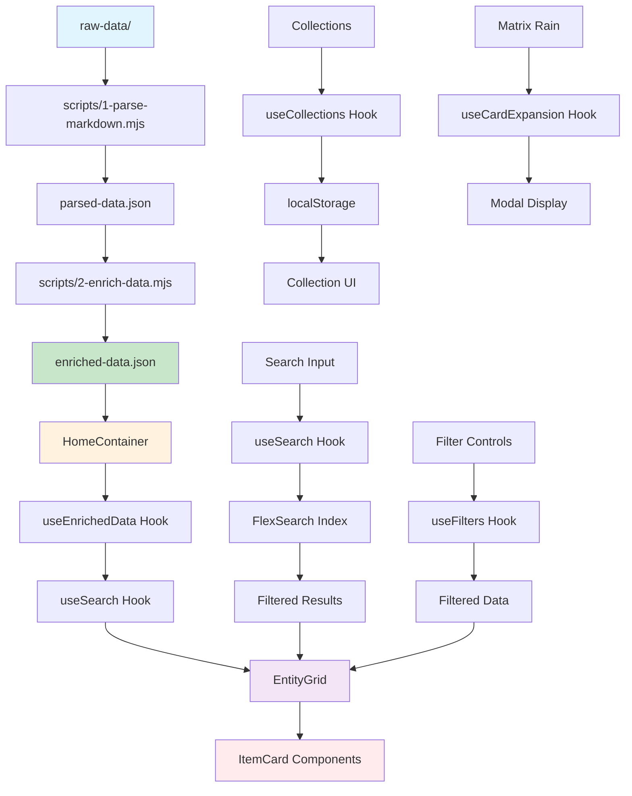

## 📊 Detailed Flow Breakdown

### 1. Data Ingestion Phase
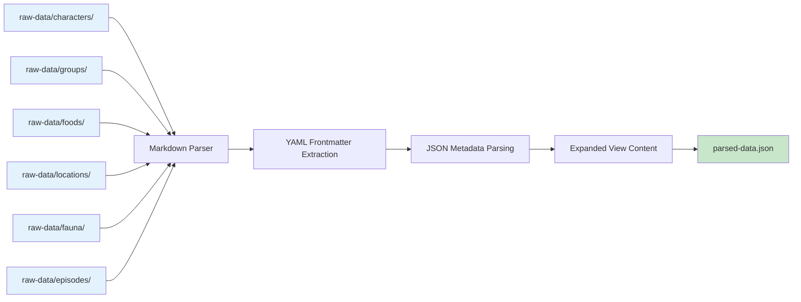

### 2. Data Enrichment Phase
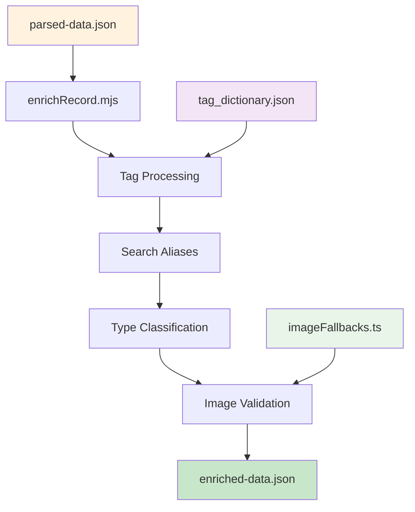

### 3. Frontend Data Consumption
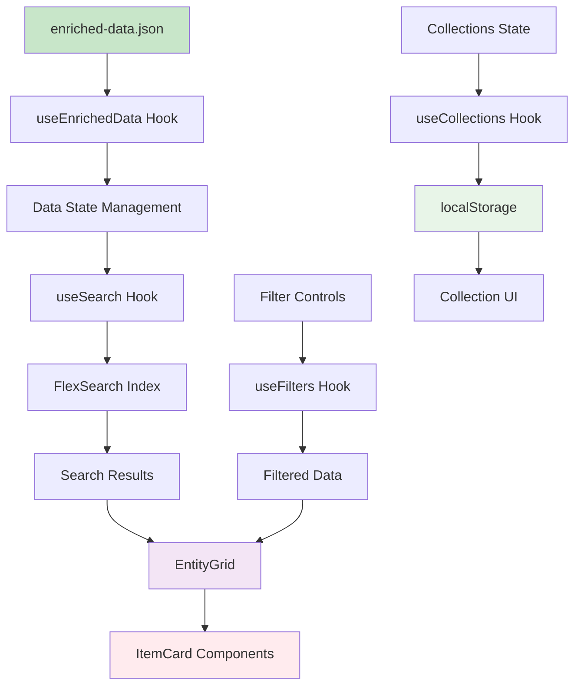

### 4. Component Hierarchy
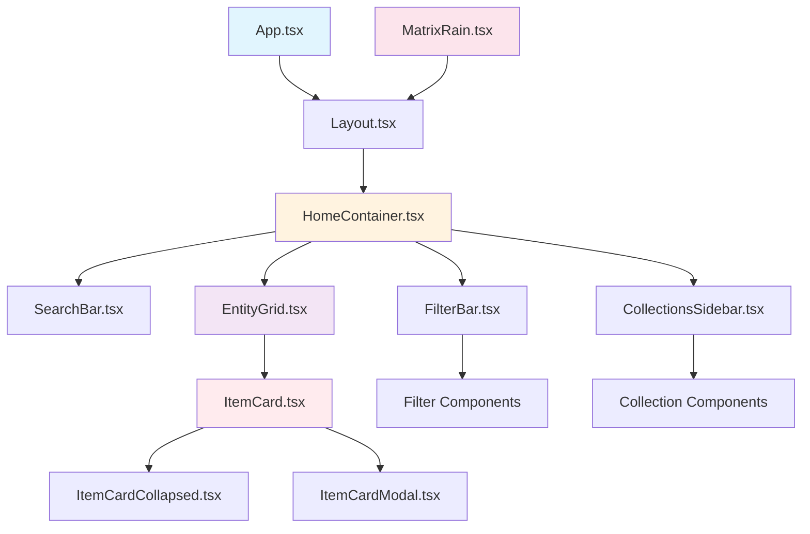

## 🔧 Hook Dependencies

### Core Data Hooks
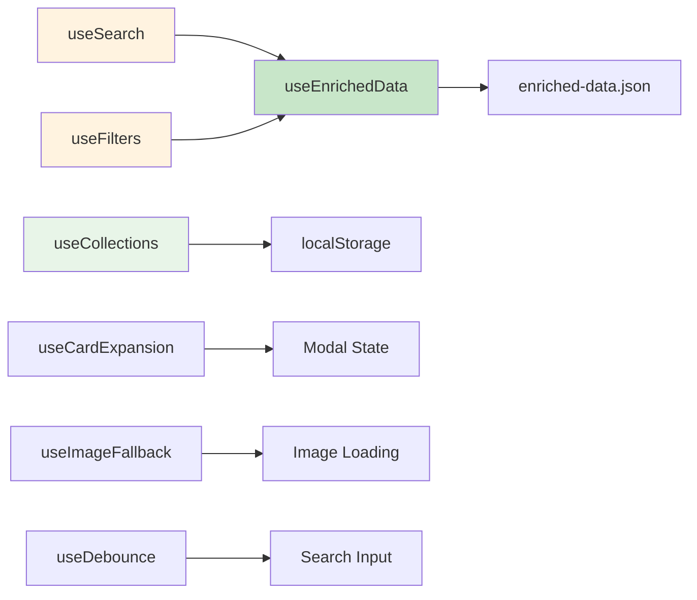

## 📈 Performance Flow

### Search Performance
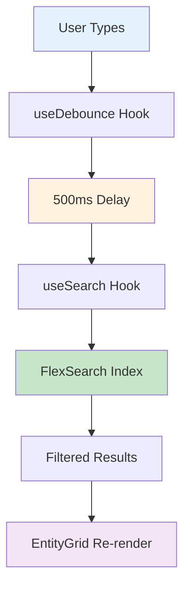

### Image Loading Flow
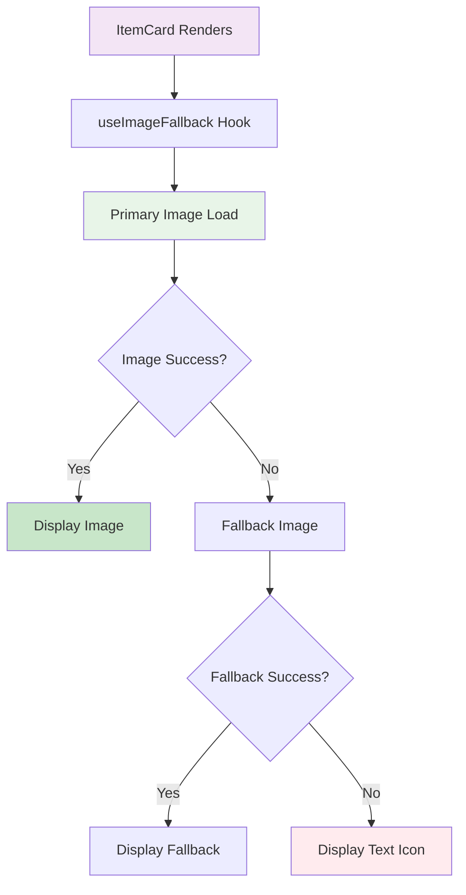

## 🔄 State Management Flow

### Collections State
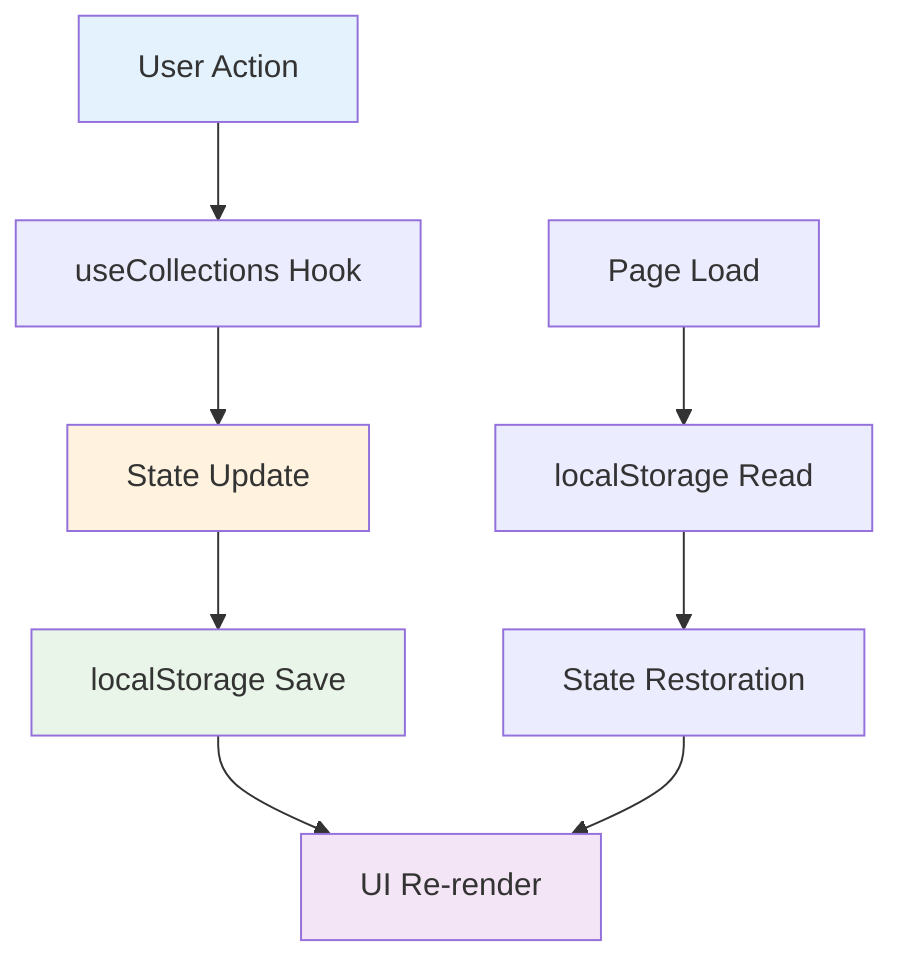

### Collections System Flow (2025 Update)
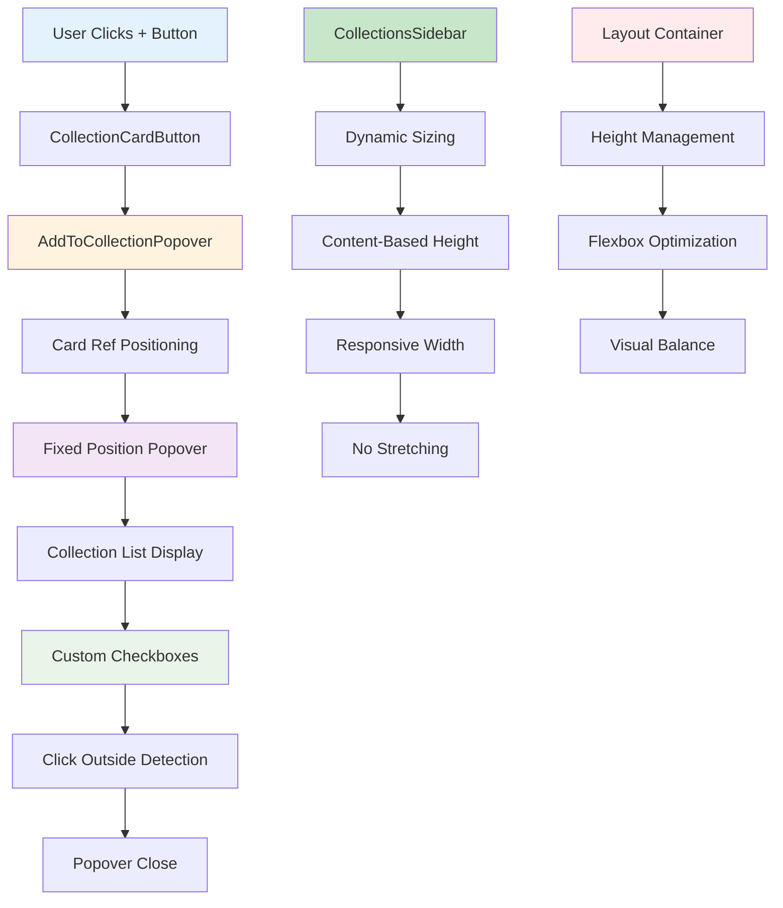

### Enhanced Collections Components Flow
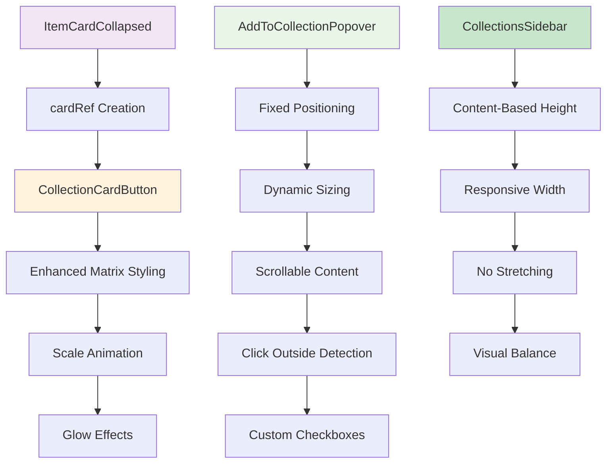

## 🎯 Key Data Transformations

### Raw Markdown → Enriched JSON
1. **YAML Frontmatter** → Structured metadata
2. **Markdown Content** → Expanded view HTML
3. **Image References** → Validated file paths
4. **Tag Arrays** → Normalized and validated
5. **Search Aliases** → Generated from content

### Enriched JSON → UI Components
1. **Type Classification** → Component selection
2. **Image Loading** → Fallback handling
3. **Search Indexing** → FlexSearch optimization
4. **Filter Processing** → Real-time filtering
5. **Collection State** → localStorage persistence

## 📊 Data Volume Metrics

- **Raw Markdown Files:** ~165+ files
- **Parsed Records:** ~165+ JSON objects
- **Enriched Records:** ~165+ with additional metadata
- **Search Index:** ~165+ indexed documents
- **Image Assets:** ~165+ character/group/food images
- **Tag Dictionary:** ~200+ normalized tags
- **Food Items:** 98 items
- **Character Items:** 67 items
- **Group Items:** ~10+ items

## 🔗 Related Documentation

- **Data Pipeline:** See `docs/data_pipeline.md` for processing details
- **Frontend Architecture:** See `docs/frontend_architecture.md` for component structure
- **Troubleshooting:** See `docs/troubleshooting.md` for flow issues
- **Source of Truth:** See `docs/source_of_truth.md` for standards

---

*Last Updated: January 2025*  
*Flow Diagrams: Mermaid.js*

