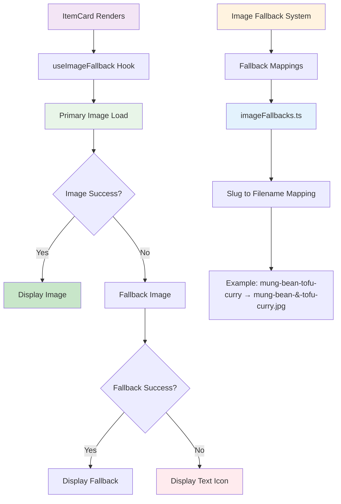

### Image Loading Flow

```mermaid
graph TD
    A[ItemCard Renders] --> B[useImageFallback Hook]
    B --> C[Primary Image Load]
    C --> D{Image Success?}
    D -->|Yes| E[Display Image]
    D -->|No| F[Fallback Image]
    F --> G{Fallback Success?}
    G -->|Yes| H[Display Fallback]
    G -->|No| I[Display Text Icon]
    
    J[Image Fallback System] --> K[Fallback Mappings]
    K --> L[imageFallbacks.ts]
    L --> M[Slug to Filename Mapping]
    M --> N[Example: mung-bean-tofu-curry → mung-bean-&-tofu-curry.jpg]
    
    style A fill:#f3e5f5
    style C fill:#e8f5e8
    style E fill:#c8e6c9
    style I fill:#ffebee
    style J fill:#fff3e0
    style L fill:#e3f2fd
``` 