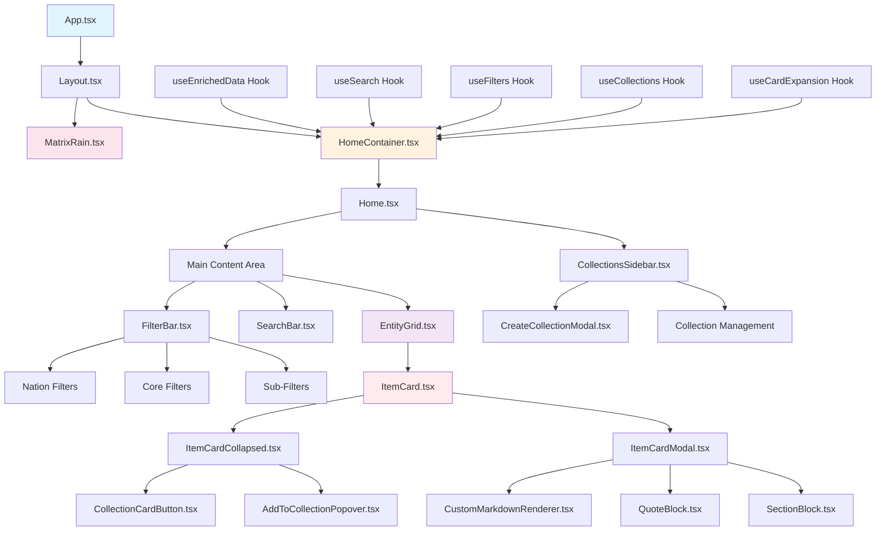
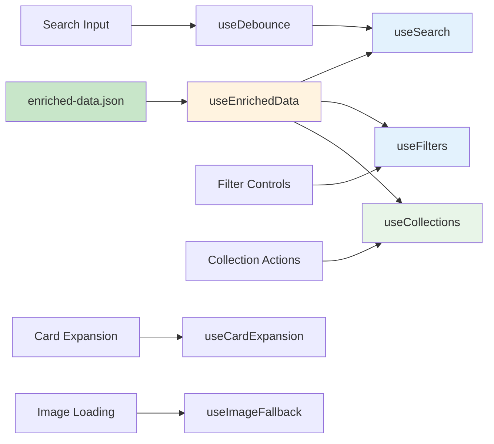
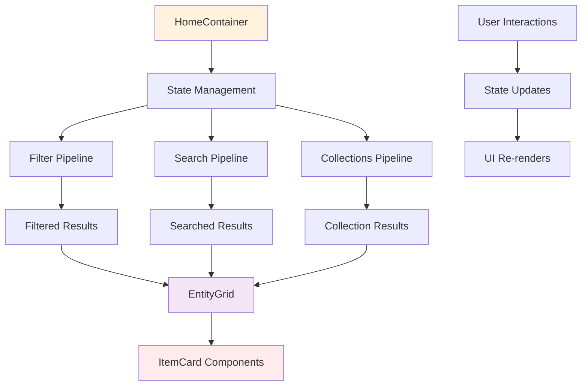

# 🏗️ Frontend Architecture & Logic (2025 January Update)

## 📊 Component Hierarchy



## 🔧 Hook Dependencies



## 🎯 Data Flow Architecture



---

## 1. HomeContainer.tsx: The Central Orchestrator

- **Data Fetching:** On initial load, fetches `public/enriched-data.json` (the only data file used by the app) using the `useEnrichedData` hook.
- **State Management:** Manages the user's search query, collection selection, and the `expandedCardId` for modal views.
- **Search Logic:** Calls the `useSearch` hook, passing the filtered dataset and the current query.
- **Collections:** Uses the `useCollections` hook to create, store, and filter collections via `localStorage`.
- **Enhanced Filtering:** Manages comprehensive filtering state including nations, categories, subcategories, age ranges, gender, and bender classification.
- **Sequential Pipeline:** Implements the filtering pipeline: Collections → Nations → Categories → Subcategories → Age/Gender/Bender → Search.
- **NEW (2025):** Template exclusion system prevents template files from being processed as data.

---

## 2. Home.tsx: Presentational Layer

- **Pure Component:** Receives all data and handlers from `HomeContainer`.
- **Layout Management:** Renders the main layout with `CollectionsSidebar` and content area.
- **Filter Integration:** Renders the `FilterBar` component with all filtering props.
- **Search Integration:** Renders the `SearchBar` component below filters.
- **Grid Rendering:** Passes filtered results to `EntityGrid` for card display.

---

## 3. Enhanced Multi-Layered Filtering System (2025 Update)

### FilterBar Component (`src/components/Filters/FilterBar.tsx`)

**Nation Filtering:**
- **PNG Images:** Uses custom nation PNG images from `public/assets/images/` instead of React icons
- **Images:** `air_nation.png`, `water_nation.png`, `earth_nation.png`, `fire_nation.png`
- **Multi-Select:** Supports selecting multiple nations simultaneously (OR logic)
- **Partial Matching:** Handles full nation names ("Fire Nation", "Earth Kingdom") with single-word filter buttons ("fire", "earth")
- **Visual Effects:** Glowing terminal indicators with Matrix-themed styling

**Core Filtering:**
- **Categories:** Characters, Groups, Locations, Foods, Fauna, Spirits
- **Single-Select:** Only one category can be active at a time
- **Sharp Terminal Keys:** Matrix-themed button styling with glassmorphism effects
- **NEW (2025):** Groups filter replaces the old 'bending' filter

**Sub-Filtering:**
- **Dynamic Options:** Sub-filters appear only when a core filter is selected
- **Age Ranges:** Child, teen, young adult, adult, elder (with animal exclusion)
- **Gender Filters:** Male/female with React icon symbols (♂/♀)
- **Bender Filters:** Bender/nonbender classification
- **Multi-Select:** Multiple sub-filters can be active simultaneously
- **Comprehensive Mapping:** Translates filter terms to data values (e.g., "villains" → "antagonist")

**Responsive Design:**
- **Flex-Wrap Layout:** Buttons wrap to new lines on smaller screens
- **Adaptive Sizing:** Button sizes adjust for mobile devices
- **Touch-Friendly:** Larger tap targets for mobile interaction

### Filtering Logic (`src/pages/HomeContainer.tsx`)

**Sequential Pipeline:**
1. **Collections Filter:** Filter by selected collection IDs
2. **Nation Filter:** Filter by nation using partial string matching
3. **Category Filter:** Filter by entity type (character, location, group, etc.)
4. **Sub-Filter:** Apply comprehensive sub-filtering with mapping
5. **Search:** Apply text search to filtered results

**Nation Filtering:**
```typescript
if (activeNations.size > 0) {
  itemsToFilter = itemsToFilter.filter(item => 
    item.nation && activeNations.has(item.nation.toLowerCase())
  );
}
```

**Sub-Filter Mapping:**
- **Age Ranges:** Maps to `ageRange` field with animal exclusion
- **Gender:** Maps to `gender` field with male/female values
- **Bender:** Maps to `isBender` and `bendingElement` fields
- **Role-Based:** Maps filter terms to role, narrativeFunction, and eraAppearances

**Animal Exclusion Logic:**
```typescript
// Excludes animals from age range filters
const animalSpecies = ['bison', 'lemur', 'bear', 'animal', 'spirit'];
const isAnimal = item.species && animalSpecies.some(species => 
  item.species.toLowerCase().includes(species)
);
```

---

## 4. Matrix Rain Integration (2025 Update)

### MatrixRain Component (`src/components/MatrixRain/MatrixRain.tsx`)

**Canvas-Based Rendering:**
- **Single Component:** 122-line React component replacing 287+ lines of CSS
- **True Randomness:** Every character randomly generated each frame
- **Authentic Aesthetic:** Movie-accurate bright leading characters with proper trails
- **Performance:** Uses `requestAnimationFrame` for smooth 60fps animation with adaptive frame skipping
- **Modal Integration:** Reduces intensity when modal is open (frame skipping, reduced opacity, dimmed colors)
- **Responsive:** Auto-calculates columns based on screen width
- **Clean Integration:** Transparent backgrounds allow rain to show through UI gaps

**Rendering Strategy:**
1. **Dual-Layer Rendering:** Fade layer followed by character layer for clean trails
2. **Progressive Fade:** Optimized fade opacity (`rgba(13, 17, 23, 0.2)`) prevents muddy background
3. **Character Hierarchy:** Bright leaders (`#c8ffc8`) over standard trails (`#70ab6c`)
4. **Adaptive Performance:** Frame skipping and reduced opacity when modal is open
5. **Memory Management:** Proper cleanup of animation frames and event listeners

---

## 5. Card System & Modal Management

### ItemCard Component (`src/components/ItemCard/ItemCard.tsx`)

**Dual-Mode Rendering:**
- **Collapsed Mode:** Small grid card with basic information
- **Expanded Mode:** Full-screen modal with detailed view and large image

**Matrix Integration:**
- **Transparent Backgrounds:** Removed `bg-background` to prevent grey boxes blocking Matrix rain
- **Glassmorphism Effects:** Semi-transparent backgrounds with backdrop blur for depth
- **Matrix Glow on Hover:** CRT green glow effects using multiple box-shadow layers

**Image Handling:**
- **Fallback System:** Uses `useImageFallback` hook for robust image handling
- **Responsive Images:** Adapts to different screen sizes
- **Loading States:** Graceful handling of image loading and errors

### ItemCardCollapsed Component (Updated 2025)

**Dynamic Type Labels:**
- **Enhancement:** Dynamic type detection instead of hardcoded "Character"
- **Logic:** Displays "Group", "Location", "Food", "Fauna", "Spirit", or "Character" based on item type
- **Accessibility:** Updated aria-label from "Character details" to "Item details"

**Collections Integration:**
- **Collection Button:** Matrix-themed button in top-right corner
- **Visual States:** Different icons for in/out of collection states
- **Hover Effects:** CRT green glow effects matching the theme

---

## 6. Collections System (2025 Update)

### CollectionsSidebar Component (`src/components/Collections/CollectionsSidebar.tsx`)

**Local Storage Integration:**
- **Persistent Storage:** Collections saved to `localStorage`
- **Real-Time Updates:** Immediate UI updates when collections change
- **Error Handling:** Graceful fallback if storage is unavailable

**Collection Management:**
- **Create Collections:** Modal interface for creating new collections
- **Add/Remove Cards:** Button-based card management with popover interface
- **Collection Filtering:** Filter entire dataset by collection membership
- **Visual Feedback:** Clear indication of active collection

### Collection Components

**CollectionCardButton:**
- **Matrix Styling:** CRT green glow effects with backdrop blur
- **Visual States:** Plus icon for add, checkmark for in collection
- **Positioning:** Top-right corner of each card

**AddToCollectionPopover:**
- **Dropdown Interface:** Shows all collections with checkboxes
- **Create New:** Option to create new collection
- **Matrix Theme:** Semi-transparent background with CRT styling

**CreateCollectionModal:**
- **Modal Interface:** Clean form for collection creation
- **Validation:** Ensures unique collection names
- **Matrix Styling:** Consistent with overall theme

---

## 7. Search Engine Integration

### useSearch Hook (`src/hooks/useSearch.ts`)

**Client-Side Indexing:**
- **FlexSearch Integration:** Fast, fuzzy search with typo tolerance
- **Preprocessing:** Combines all searchable fields into searchable text
- **Memoization:** Index built once per session for performance
- **Real-Time Results:** Instant search results as user types

**Searchable Fields:**
- **Primary:** Name, role, titles
- **Secondary:** Tags, ageRange, gender, bendingElement
- **Metadata:** Nation, eraAppearances, narrativeFunction

---

## 8. Data Pipeline Integration (2025 Update)

### Template Exclusion System
- **Parser Enhancement:** Automatic exclusion of files in `templates/` subdirectories
- **Implementation:** Added filter in `scripts/1-parse-markdown.mjs`
- **Pattern:** `!/[/\\\\]templates[/\\\\]/.test(p)`
- **Benefit:** Prevents template files from being processed as real data

### Expanded View Processing
- **Format Requirement:** Content must be wrapped in ```md code blocks
- **Parser Logic:** Extracts content between ```md and ``` markers
- **Debug Logging:** Shows `[DEBUG] Found Expanded View block: true/false`
- **Issue Resolution:** Fixed double ```md blocks in group files

### Image Path Validation
- **Requirement:** Image paths must match actual files in `public/assets/images/`
- **Validation:** All image paths verified during processing
- **Fixes Applied:** Corrected paths for Order of the White Lotus, Si Wong Tribes, Water Tribe Military

### JSON Syntax Validation
- **Requirement:** All JSON blocks must have valid syntax
- **Common Issues:** Trailing commas in arrays and objects
- **Validation:** Parser checks for JSON syntax errors and reports them
- **Fixes Applied:** Removed trailing commas from all group files

---

## 9. Styling Architecture

### Tailwind CSS Integration
- **Utility-First:** All styling done through Tailwind classes
- **Custom Properties:** CSS variables for theme colors and effects
- **Matrix Theme:** CRT green (`#70ab6c`) with glow effects
- **Glassmorphism:** Semi-transparent backgrounds with backdrop blur

### Custom CSS Classes
- **`.crt-glow-text`:** Multi-layered text shadow for luminous effect
- **`.matrix-card-glow`:** Sophisticated hover effects with pseudo-elements
- **`.crt-flicker`:** Subtle animation mimicking CRT refresh
- **`.crt-screen`:** Scanline and dithering effects

---

## 10. Performance Optimizations

### React Optimizations
- **Memoization:** `useMemo` and `useCallback` for expensive operations
- **Lazy Loading:** Images loaded on demand with fallbacks
- **Virtual Scrolling:** Efficient rendering of large lists
- **State Management:** Minimal re-renders through proper state structure

### Animation Performance
- **requestAnimationFrame:** Smooth 60fps Matrix rain animation
- **Adaptive Frame Skipping:** Reduces animation intensity when modal is open
- **Canvas Optimization:** Efficient rendering with proper cleanup
- **Memory Management:** Proper cleanup of animation frames and event listeners

---

## 11. Accessibility & Responsive Design

### Accessibility Features
- **ARIA Labels:** All interactive elements properly labeled
- **Keyboard Navigation:** Full keyboard support throughout
- **Screen Reader Support:** Semantic HTML structure
- **High Contrast:** Maintains accessibility standards

### Responsive Design
- **Mobile-First:** Designed for all screen sizes
- **Touch-Friendly:** Larger tap targets for mobile
- **Adaptive Layout:** Flex-wrap and responsive grids
- **Performance:** Optimized for mobile devices

---

## Summary

The frontend architecture provides a robust, performant, and accessible foundation for the Austros ATLA World encyclopedia. The 2025 January update introduces:

- **Enhanced Multi-Layered Filtering:** Comprehensive filtering with PNG nation images, age ranges, gender, and bender classification
- **Matrix Rain Integration:** Authentic background effects with adaptive performance
- **Glassmorphism UI:** Modern visual effects with depth and transparency
- **Collections System:** Matrix-themed collection management with localStorage persistence
- **New Data Types:** Support for groups, foods, locations, and episodes with dynamic type detection
- **Template Exclusion:** Automatic exclusion of template files from data processing
- **Enhanced Data Validation:** Image path validation, JSON syntax checking, and expanded view processing
- **Responsive Design:** Works seamlessly across all devices
- **Accessibility Compliance:** Inclusive user experience for all users

The combination of these features creates a cohesive, high-performance application that delivers both visual impact and functional utility while maintaining the distinctive Matrix/CRT aesthetic.
