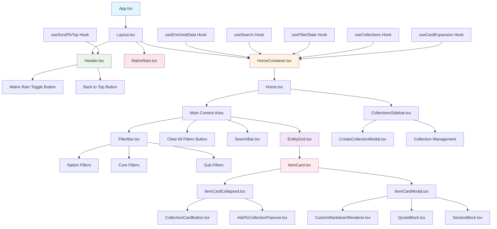
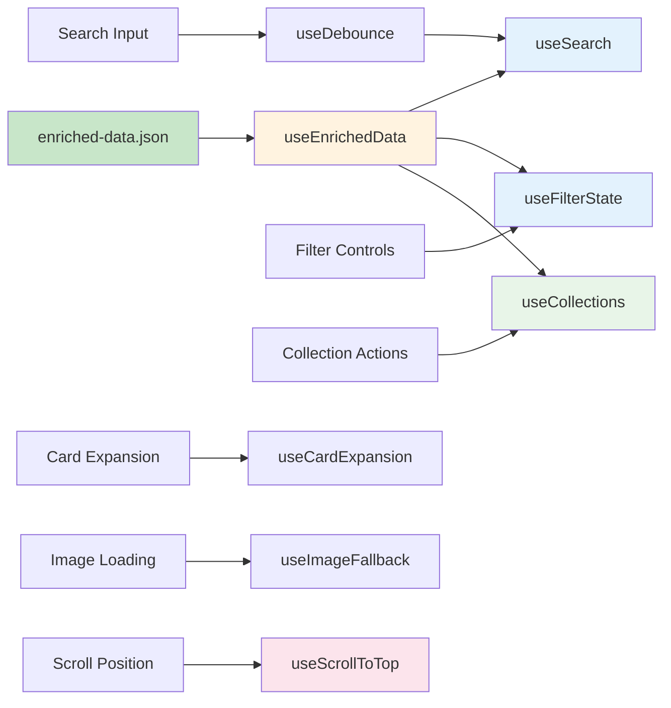
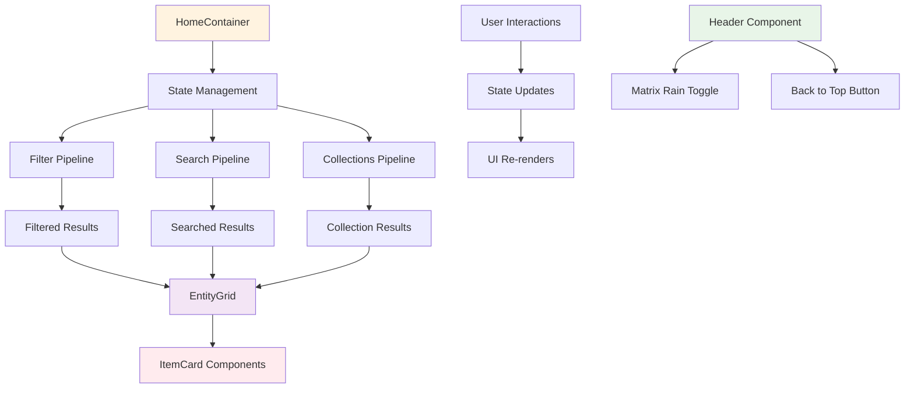

# 🏗️ Frontend Architecture & Logic (2025 January Update)

## 📊 Component Hierarchy



## 🔧 Hook Dependencies



## 🎯 Data Flow Architecture



---

## 1. Header Component (2025 January Update)

### Header.tsx (`src/components/Header.tsx`)

**Matrix Rain Toggle Button:**
- **Location:** Fixed position in top-right corner (`fixed top-4 right-4`)
- **Default State:** Matrix Rain is OFF by default
- **Button Text:** 
  - When OFF: "ENTER MATRIX"
  - When ON: "EXIT MATRIX"
- **Styling:** Matrix-themed with CRT green glow effects and backdrop blur
- **State Management:** Controlled by `matrixRainEnabled` prop from Layout component

**Back to Top Button:**
- **Location:** Fixed position in bottom-right corner (`fixed bottom-8 right-8`)
- **Visibility:** Only appears when user scrolls down more than 300px
- **Icon:** Up arrow (FaArrowUp from react-icons)
- **Behavior:** Smooth scroll to top when clicked
- **Styling:** Consistent with project's retro terminal aesthetic

**Layout Integration:**
- **No Header Background:** Clean floating button design without black header background
- **Z-Index Management:** Proper layering with `z-50` for header, `z-40` for back-to-top
- **Responsive Design:** Adapts to different screen sizes

### useScrollToTop Hook (`src/hooks/useScrollToTop.ts`)

**Scroll Detection:**
- **Threshold:** Shows back-to-top button when scroll position > 300px
- **Event Listener:** Monitors `window.pageYOffset` and `document.documentElement.scrollTop`
- **Cleanup:** Properly removes event listeners on component unmount

**Smooth Scrolling:**
- **Implementation:** Uses `window.scrollTo()` with `behavior: 'smooth'`
- **Performance:** Optimized for smooth scrolling experience
- **Accessibility:** Proper ARIA labels for screen readers

---

## 2. Layout Component (2025 January Update)

### Layout.tsx (`src/components/Layout.tsx`)

**Matrix Rain Integration:**
- **Conditional Rendering:** MatrixRain component only renders when `matrixRainEnabled` is true
- **State Management:** Uses `useState` to track Matrix Rain toggle state
- **Performance:** Prevents unnecessary canvas rendering when Matrix Rain is disabled
- **Modal Integration:** Passes `modalOpen` prop to MatrixRain for adaptive performance

**Header Integration:**
- **Component Composition:** Includes Header component with all necessary props
- **State Passing:** Passes Matrix Rain state and scroll handlers to Header
- **Clean Architecture:** Separates concerns between layout and header functionality

---

## 3. HomeContainer.tsx: The Central Orchestrator (2025 Performance Update)

- **Data Fetching:** On initial load, fetches `public/enriched-data.json` (the only data file used by the app) using the `useEnrichedData` hook.
- **State Management:** Manages the user's search query, collection selection, and the `expandedCardId` for modal views.
- **Search Logic:** Calls the `useSearch` hook, passing the filtered dataset and the current query.
- **Collections:** Uses the `useCollections` hook to create, store, and filter collections via `localStorage`.
- **Performance Optimized Filtering:** Uses `useFilterState` hook and `applyFilters` utility for memoized filtering with `useMemo`.
- **Memoized Pipeline:** Implements the filtering pipeline with performance optimization: Collections → Nations → Categories → Subcategories → Age/Gender/Bender → Search.
- **NEW (2025):** Template exclusion system prevents template files from being processed as data.
- **Performance Enhancement:** Reduced from ~200 lines to 64 lines (68% reduction) through code organization and separation of concerns.
- **Clear All Filters:** Added `handleClearAllFilters` function to reset all filter states.

---

## 4. Home.tsx: Presentational Layer

- **Pure Component:** Receives all data and handlers from `HomeContainer`.
- **Layout Management:** Renders the main layout with `CollectionsSidebar` and content area.
- **Filter Integration:** Renders the `FilterBar` component with all filtering props.
- **Clear All Filters Button:** Conditionally renders clear button between filters and search bar.
- **Search Integration:** Renders the `SearchBar` component below filters.
- **Grid Rendering:** Passes filtered results to `EntityGrid` for card display.

---

## 5. Enhanced Multi-Layered Filtering System (2025 January Update)

### FilterBar Component (`src/components/Filters/FilterBar.tsx`)

**Nation Filtering:**
- **PNG Images:** Uses custom nation PNG images from `public/assets/images/` instead of React icons
- **Images:** `air_nation.png`, `water_nation.png`, `earth_nation.png`, `fire_nation.png`
- **Multi-Select:** Supports selecting multiple nations simultaneously (OR logic)
- **Partial Matching:** Handles full nation names ("Fire Nation", "Earth Kingdom") with single-word filter buttons ("fire", "earth")
- **Visual Effects:** Glowing terminal indicators with Matrix-themed styling
- **100% Opaque:** Nation buttons now use solid black background for maximum readability

**Core Filtering (January 2025 Update):**
- **Categories:** Characters, Groups, Locations, Foods, Fauna, Spirits
- **Single-Select:** Only one category can be active at a time
- **Perfect DOS Font:** Core filter buttons now use `font-perfect-dos font-bold` for better readability
- **React Icons:** Each core filter has a color-coded React icon:
  - 👥 **Characters**: `FaUsers` - Blue (`text-blue-400`)
  - 🍽️ **Foods**: `FaUtensils` - Orange (`text-orange-400`) 
  - 📍 **Locations**: `FaMapMarkerAlt` - Green (`text-green-400`)
  - 👥 **Groups**: `FaLayerGroup` - Purple (`text-purple-400`)
  - 🐾 **Fauna**: `FaPaw` - Yellow (`text-yellow-400`)
  - 👻 **Spirits**: `FaGhost` - Cyan (`text-cyan-400`)
- **Sharp Terminal Keys:** Matrix-themed button styling with glassmorphism effects

**Sub-Filtering (January 2025 Update):**
- **Dynamic Options:** Sub-filters appear only when a core filter is selected
- **Age Ranges:** Child, teen, young adult, adult, elder (with animal exclusion)
- **Gender Filters:** Male/female with React icon symbols (♂/♀)
- **Bender Filters:** Bender/nonbender classification
- **Multi-Select:** Multiple sub-filters can be active simultaneously
- **Comprehensive Mapping:** Translates filter terms to data values (e.g., "villains" → "antagonist")
- **Larger Icons:** Subfilter icons increased from `w-4 h-4` to `w-5 h-5` for better visibility
- **Color-Coded Text:** Character subfilters now have color-coded text:
  - **Age Groups:** Yellow (child), Blue (teen), Green (young adult), Purple (adult), Gray (elder)
  - **Character Types:** Green (heroes), Red (villains), Blue (mentors)
  - **Bending Status:** Orange (bender), Gray (nonbender)
- **Perfect DOS Font:** Subfilter text uses `font-perfect-dos` for better readability

**Food Sub-Filters (2025 Update):**
- **12 Categories:** beverages, desserts, soups, meat, vegetables, noodles, dumplings, preserved, street food, traditional, vegetarian, luxury, ceremonial, health, fire-themed, seafood
- **React Emojis:** Each sub-filter includes React emoji with descriptive text labels
- **Comprehensive Coverage:** All 98 food items categorized into appropriate sub-filters
- **Nation Integration:** Food items display nation symbols in cards
- **Multi-Select Support:** Multiple food categories can be selected simultaneously

**Clear All Filters Button (January 2025 Update):**
- **Smart Visibility:** Only appears when any filters are active (nations, core filters, or subfilters)
- **Perfect Positioning:** Centered between subfilters and search bar with proper spacing
- **Consistent Styling:** Matches filter button styling with Perfect DOS font
- **One-Click Reset:** Clears all filter states instantly
- **Enhanced UX:** Provides immediate visual feedback and keeps UI clean

**Responsive Design:**
- **Flex-Wrap Layout:** Buttons wrap to new lines on smaller screens
- **Adaptive Sizing:** Button sizes adjust for mobile devices
- **Touch-Friendly:** Larger tap targets for mobile interaction

### Filtering Logic (`src/pages/HomeContainer.tsx`)

**Performance Optimized Pipeline:**
1. **Collections Filter:** Filter by selected collection IDs
2. **Nation Filter:** Filter by nation using partial string matching
3. **Category Filter:** Filter by entity type (character, location, group, etc.)
4. **Sub-Filter:** Apply comprehensive sub-filtering with mapping
5. **Search:** Apply text search to filtered results
6. **Memoization:** All filtering results cached with `useMemo` to prevent wasteful re-computation

**Nation Filtering:**
```typescript
if (activeNations.size > 0) {
  itemsToFilter = itemsToFilter.filter(item => 
    item.nation && activeNations.has(item.nation.toLowerCase())
  );
}
```

**Sub-Filter Mapping:**
- **Age Ranges:** Maps to `ageRange` field with animal exclusion
- **Gender:** Maps to `gender` field with male/female values
- **Bender:** Maps to `isBender` and `bendingElement` fields
- **Role-Based:** Maps filter terms to role, narrativeFunction, and eraAppearances
- **Food Categories:** Maps to food category tags with comprehensive coverage

**Animal Exclusion Logic:**
```typescript
// Excludes animals from age range filters
const animalSpecies = ['bison', 'lemur', 'bear', 'animal', 'spirit'];
const isAnimal = item.species && animalSpecies.some(species => 
  item.species.toLowerCase().includes(species)
);
```

**Food Category Filtering:**
- **12 Sub-Categories:** Comprehensive food categorization system
- **Tag-Based:** Uses food category tags for filtering
- **Nation Integration:** Food items display nation symbols
- **Multi-Select:** Supports selecting multiple food categories

---

## 6. Matrix Rain Integration (2025 Update)

### MatrixRain Component (`src/components/MatrixRain/MatrixRain.tsx`)

**Canvas-Based Rendering:**
- **Static Grid:** Characters stay in fixed cells while waves of brightness move downward.
- **Flipped & Rotated Glyphs:** Each cell stores a random orientation for authentic visual variety.
- **Multiple Streams:** Columns can host several drops with random speed and start delays.
- **Random Glyph Cycling:** Symbols change over time inside the illuminated trails.
- **Performance:** Uses `requestAnimationFrame` for smooth 60fps animation with adaptive frame skipping.
- **Modal Integration:** Reduces intensity when modal is open.
- **Responsive:** Auto-calculates columns based on screen width and cleans up listeners on resize.
- **Conditional Rendering:** Only renders when `matrixRainEnabled` is true (controlled by Header toggle)

**Rendering Strategy:**
1. **Dual-Layer Rendering:** Fade layer followed by character layer for clean trails
2. **Progressive Fade:** Optimized fade opacity (`rgba(13, 17, 23, 0.2)`) prevents muddy background
3. **Character Hierarchy:** Bright leaders (`#c8ffc8`) over standard trails (`#70ab6c`)
4. **Adaptive Performance:** Frame skipping and reduced opacity when modal is open
5. **Memory Management:** Proper cleanup of animation frames and event listeners

---

## 7. Card System & Modal Management

### ItemCard Component (`src/components/ItemCard/ItemCard.tsx`)

**Dual-Mode Rendering:**
- **Collapsed Mode:** Small grid card with basic information
- **Expanded Mode:** Full-screen modal with detailed view and large image

**Matrix Integration:**
- **Transparent Backgrounds:** Removed `bg-background` to prevent grey boxes blocking Matrix rain
- **Glassmorphism Effects:** Semi-transparent backgrounds with backdrop blur for depth
- **Matrix Glow on Hover:** CRT green glow effects using multiple box-shadow layers

**Image Handling:**
- **Fallback System:** Uses `useImageFallback` hook for robust image handling
- **Responsive Images:** Adapts to different screen sizes
- **Loading States:** Graceful handling of image loading and errors

### ItemCardCollapsed Component (Updated 2025)

**Dynamic Type Labels:**
- **Enhancement:** Dynamic type detection instead of hardcoded "Character"
- **Logic:** Displays "Group", "Location", "Food", "Fauna", "Spirit", or "Character" based on item type
- **Accessibility:** Updated aria-label from "Character details" to "Item details"

**Collections Integration:**
- **Collection Button:** Matrix-themed button in top-right corner
- **Visual States:** Different icons for in/out of collection states
- **Hover Effects:** CRT green glow effects matching the theme

**Nation Symbol & Color Integration (2025 Update):**
- **Food Cards:** Display nation symbols for all food items
- **Character Cards:** Display nation symbols for all characters
- **Group Cards:** Display nation symbols for all groups
- **NationIcon Component:** Maps nation strings to React icons
- **Consistent Display:** All entity types show nation affiliation
- **Enhanced Icon Sizing (2025 January Update):** Nation icons have been increased in size for better visibility and prominence:
  - **Grid Cards:** Increased from `size={8}` to `size={12}` (50% larger)
  - **Modal Cards:** Increased from `size={20}` to `size={24}` (20% larger)
  - **Visual Impact:** Nation icons are now significantly more prominent and easier to identify across all card types

---

## 8. Collections System (2025 Update)

### CollectionsSidebar Component (`src/components/Collections/CollectionsSidebar.tsx`)

**Local Storage Integration:**
- **Persistent Storage:** Collections saved to `localStorage`
- **Real-Time Updates:** Immediate UI updates when collections change
- **Error Handling:** Graceful fallback if storage is unavailable

**Dynamic Sizing (2025 Update):**
- **Content-Based Height:** Uses `h-fit` instead of fixed height to grow only as needed
- **Responsive Width:** `w-auto min-w-[200px] max-w-[280px]` for flexible sizing
- **No Stretching:** Removed `sticky top-20` and replaced with `self-start` to prevent forced height
- **Parent Container Fixes:** Removed `min-h-screen` from Layout and Home containers to prevent stretching
- **Visual Result:** Sidebar now appears as a compact, content-sized panel instead of a long column

**Collection Management:**
- **Create Collections:** Modal interface for creating new collections
- **Add/Remove Cards:** Button-based card management with popover interface
- **Collection Filtering:** Filter entire dataset by collection membership
- **Visual Feedback:** Clear indication of active collection

### Collection Components

**CollectionCardButton (Enhanced 2025):**
- **Enhanced Matrix Styling:** Larger size (`w-7 h-7`) with thicker border (`border-2`)
- **Improved Glow Effects:** Stronger shadows (`shadow-[0_0_20px_rgba(112,171,108,0.8)]`) for dramatic glow
- **Interactive Animations:** Scale animation (`hover:scale-110`) and smooth transitions (`duration-300`)
- **Better Typography:** Bold fonts with drop shadows for glowing text effect
- **Enhanced States:** Different colors and glows for add/remove states
- **Visual Hierarchy:** Plus icon (`text-lg`) and checkmark (`text-sm`) with proper proportions
- **Z-Index Management:** `z-10` ensures button stays above other elements

**AddToCollectionPopover (Enhanced 2025):**
- **Fixed Positioning:** Uses `position: fixed` with dynamic positioning based on card location
- **Dynamic Sizing:** `min-width: 200px` with `overflow-y-auto` and `max-h-[80vh]` for scrolling
- **Card Integration:** Receives `cardRef` from parent card for accurate positioning
- **Click-Outside Detection:** Closes popover when clicking outside card or popover area
- **Enhanced Styling:** Semi-transparent background with CRT green borders and glow effects
- **Custom Checkboxes:** Matrix-themed checkboxes with green glow and rounded corners
- **Responsive Design:** Adapts to different collection counts with proper scrolling

**CreateCollectionModal:**
- **Modal Interface:** Clean form for collection creation
- **Validation:** Ensures unique collection names
- **Matrix Styling:** Consistent with overall theme

### Popover Positioning System (2025 Update)

**Technical Implementation:**
- **Card Reference:** `cardRef` passed from `ItemCardCollapsed` to popover
- **Fixed Positioning:** Popover positioned outside card container to avoid clipping
- **Dynamic Calculation:** Uses `getBoundingClientRect()` for accurate positioning
- **Responsive Design:** Adapts to different screen sizes and card positions
- **Overflow Handling:** Scrollable content with maximum height constraints

**User Experience Improvements:**
- **Click-Outside Detection:** Event listeners detect clicks outside popover and card
- **Smooth Transitions:** 300ms duration for all animations
- **Visual Feedback:** Clear hover and active states
- **Accessibility:** Proper ARIA labels and keyboard navigation

### Layout Integration (2025 Update)

**Container Height Management:**
- **Layout.tsx:** Removed `min-h-screen` from root container
- **Home.tsx:** Removed `min-h-screen` from main flex container, added to content area only
- **Result:** Sidebar no longer stretches to full viewport height

**Flexbox Optimization:**
- **Self-Start:** Sidebar uses `self-start` instead of `sticky` positioning
- **Content Flow:** Main content area maintains proper height constraints
- **Visual Balance:** Sidebar and content area have proper proportions

### Enhanced Visual Design (2025 Update)

**Matrix Theme Integration:**
- **CRT Green Glow:** Consistent use of `#70ab6c` and `#c8ffc8` colors
- **Backdrop Blur:** `backdrop-blur-md` for glassmorphism effects
- **Drop Shadows:** Text drop shadows for glowing effects
- **Border Effects:** Thick borders with glow for definition

**Interactive States:**
- **Hover Effects:** Scale animation and enhanced glow on hover
- **Active States:** Different colors and glows for different states
- **Transition Smoothness:** 300ms duration for all animations
- **Visual Hierarchy:** Clear distinction between add and remove states

---

## 9. Search Engine Integration

### useSearch Hook (`src/hooks/useSearch.ts`)

**Client-Side Indexing:**
- **FlexSearch Integration:** Fast, fuzzy search with typo tolerance
- **Preprocessing:** Combines all searchable fields into searchable text
- **Memoization:** Index built once per session for performance
- **Real-Time Results:** Instant search results as user types

**Searchable Fields:**
- **Primary:** Name, role, titles
- **Secondary:** Tags, ageRange, gender, bendingElement
- **Metadata:** Nation, eraAppearances, narrativeFunction
- **Food Categories:** Food category tags and nation affiliations

---

## 10. Data Pipeline Integration (2025 Update)

### Template Exclusion System
- **Parser Enhancement:** Automatic exclusion of files in `templates/` subdirectories
- **Implementation:** Added filter in `scripts/1-parse-markdown.mjs`
- **Pattern:** `!/[/\\\\]templates[/\\\\]/.test(p)`
- **Benefit:** Prevents template files from being processed as real data

### Expanded View Processing
- **Format Requirement:** Content must be wrapped in ```md code blocks
- **Parser Logic:** Extracts content between ```md and ``` markers
- **Debug Logging:** Shows `[DEBUG] Found Expanded View block: true/false`
- **Issue Resolution:** Fixed double ```md blocks in group files

### Image Path Validation
- **Requirement:** Image paths must match actual files in `public/assets/images/`
- **Validation:** All image paths verified during processing
- **Fixes Applied:** Corrected paths for Order of the White Lotus, Si Wong Tribes, Water Tribe Military

### JSON Syntax Validation
- **Requirement:** All JSON blocks must have valid syntax
- **Common Issues:** Trailing commas in arrays and objects
- **Validation:** Parser checks for JSON syntax errors and reports them
- **Fixes Applied:** Removed trailing commas from all group files

### Food Data Processing (2025 Update)
- **98 Food Items:** Complete food database with comprehensive categorization
- **12 Sub-Categories:** Beverages, desserts, soups, meat, vegetables, noodles, dumplings, preserved, street food, traditional, vegetarian, luxury, ceremonial, health, fire-themed, seafood
- **Nation Integration:** All food items have nation affiliations with symbols
- **Category Tags:** All food items categorized into appropriate sub-filters
- **Enrichment Process:** Maps region to nation, adds category tags, validates data integrity

---

## 11. Styling Architecture

### Tailwind CSS Integration
- **Utility-First:** All styling done through Tailwind classes
- **Custom Properties:** CSS variables for theme colors and effects
- **Matrix Theme:** CRT green (`#70ab6c`) with glow effects
- **Glassmorphism:** Semi-transparent backgrounds with backdrop blur

### Custom CSS Classes
- **`.crt-glow-text`:** Multi-layered text shadow for luminous effect
- **`.matrix-card-glow`:** Sophisticated hover effects with pseudo-elements
- **`.crt-flicker`:** Subtle animation mimicking CRT refresh
- **`.crt-screen`:** Scanline and dithering effects

### Perfect DOS Font Integration (January 2025 Update)
- **Font Loading:** Perfect DOS font loaded via `@font-face` in `custom.css`
- **Application:** Applied to core filters and subfilters via `font-perfect-dos` class
- **Benefits:** Better readability against complex Matrix Rain background
- **Consistency:** Matches the retro terminal aesthetic

---

## 12. Performance Optimizations (2025 Major Update)

### React Optimizations
- **Memoization:** `useMemo` and `useCallback` for expensive operations
- **React.memo:** ItemCard components wrapped with React.memo to prevent unnecessary re-renders
- **Lazy Loading:** Images loaded on demand with fallbacks and `loading="lazy"` attribute
- **Virtual Scrolling:** Efficient rendering of large lists
- **State Management:** Minimal re-renders through proper state structure

### Filtering Performance (Major Enhancement)
- **useMemo Optimization:** Complex filtering pipeline memoized to prevent wasteful re-computation on every keystroke
- **useFilterState Hook:** Extracted filter state management into reusable custom hook with useCallback optimizations
- **applyFilters Utility:** Pure function for filtering logic, isolated from component concerns
- **Performance Impact:** Filtering only re-runs when filters actually change, not on every search input
- **Code Organization:** HomeContainer reduced from ~200 lines to 64 lines (68% reduction)

### Image Loading Performance
- **Lazy Loading:** All card images use `loading="lazy"` attribute for faster initial page load
- **Fallback System:** Robust image fallback handling with graceful degradation
- **Performance Impact:** Browser only loads images when they're about to be visible

### Animation Performance
- **requestAnimationFrame:** Smooth 60fps Matrix rain animation
- **Adaptive Frame Skipping:** Reduces animation intensity when modal is open
- **Canvas Optimization:** Efficient rendering with proper cleanup
- **Memory Management:** Proper cleanup of animation frames and event listeners

---

## 13. Accessibility & Responsive Design

### Accessibility Features
- **ARIA Labels:** All interactive elements properly labeled
- **Keyboard Navigation:** Full keyboard support throughout
- **Screen Reader Support:** Semantic HTML structure
- **High Contrast:** Maintains accessibility standards

### Responsive Design
- **Mobile-First:** Designed for all screen sizes
- **Touch-Friendly:** Larger tap targets for mobile
- **Adaptive Layout:** Flex-wrap and responsive grids
- **Performance:** Optimized for mobile devices

---

## Summary

The frontend architecture provides a robust, performant, and accessible foundation for the Austros ATLA World encyclopedia. The 2025 January update introduces:

- **Header Component:** New floating header with Matrix Rain toggle and back-to-top button
- **Matrix Rain Toggle:** Clean floating button in top-right corner with conditional rendering
- **Back to Top Button:** Smart visibility button that appears on scroll with smooth scrolling
- **Enhanced Multi-Layered Filtering:** Comprehensive filtering with PNG nation images, age ranges, gender, and bender classification
- **Perfect DOS Font Integration:** Core filters and subfilters now use Perfect DOS font for better readability
- **React Icons with Color Coding:** Each core filter has a distinct icon and color for instant recognition
- **100% Opaque Nation Buttons:** Nation symbol buttons are now fully opaque for maximum readability
- **Larger Subfilter Icons:** All subfilter icons increased in size for better visibility
- **Color-Coded Character Subfilters:** Character subfilters have color-coded text for visual distinction
- **Clear All Filters Button:** Smart visibility button that resets all filter states
- **Food Category System:** 12 comprehensive food sub-categories with React emojis and text labels
- **Nation Integration:** All entity types display nation symbols with consistent theming
- **Matrix Rain Integration:** Authentic background effects with adaptive performance and toggle control
- **Glassmorphism UI:** Modern visual effects with depth and transparency
- **Collections System:** Matrix-themed collection management with localStorage persistence
- **New Data Types:** Support for groups, foods, locations, and episodes with dynamic type detection
- **Template Exclusion:** Automatic exclusion of template files from data processing
- **Enhanced Data Validation:** Image path validation, JSON syntax checking, and expanded view processing
- **Responsive Design:** Works seamlessly across all devices
- **Accessibility Compliance:** Inclusive user experience for all users

The combination of these features creates a cohesive, high-performance application that delivers both visual impact and functional utility while maintaining the distinctive Matrix/CRT aesthetic.

**Key Statistics (2025 January Update):**
- **98 Food Items:** Complete food database with nation affiliations
- **67 Character Items:** Full character roster with age/gender/bender classification
- **12+ Group Items:** Comprehensive group coverage with nation symbols
- **12 Food Sub-Categories:** Comprehensive food filtering system
- **4 Nation Types:** Fire, Water, Earth, Air with PNG images and React icons
- **Enhanced Filtering:** Multi-layered filtering with comprehensive coverage and color coding
- **Performance Optimizations:** Major performance improvements with memoized filtering and React.memo components
- **UI Enhancements:** Perfect DOS font, React icons, color coding, and 100% opaque elements
- **Header Features:** Matrix Rain toggle and back-to-top button with smart visibility

The application now provides a complete encyclopedia experience with robust filtering, comprehensive categorization, authentic Matrix/CRT aesthetics, superior performance through intelligent caching and optimization, enhanced visual distinction through color coding and improved typography, and convenient navigation features with the new header component.

`